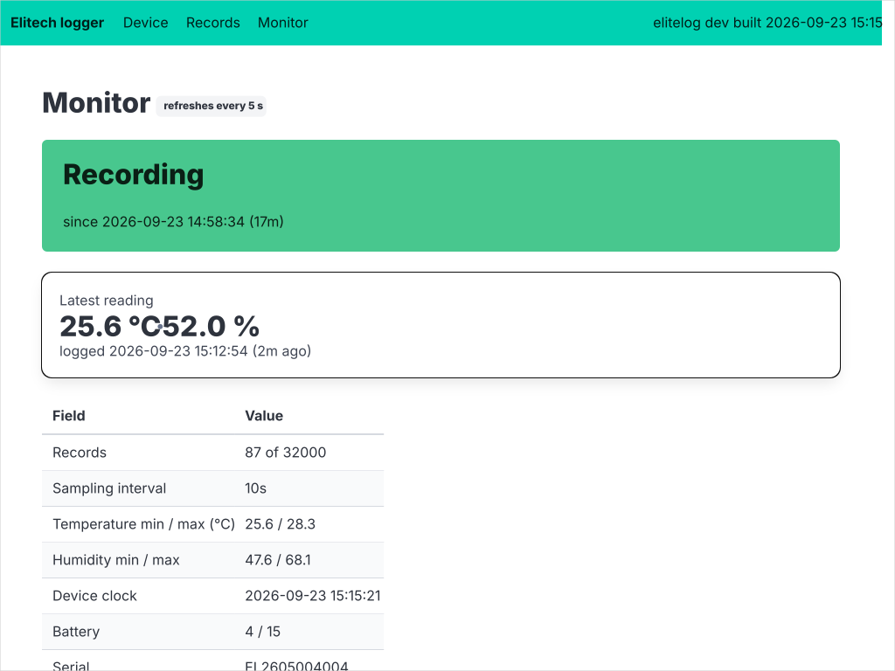
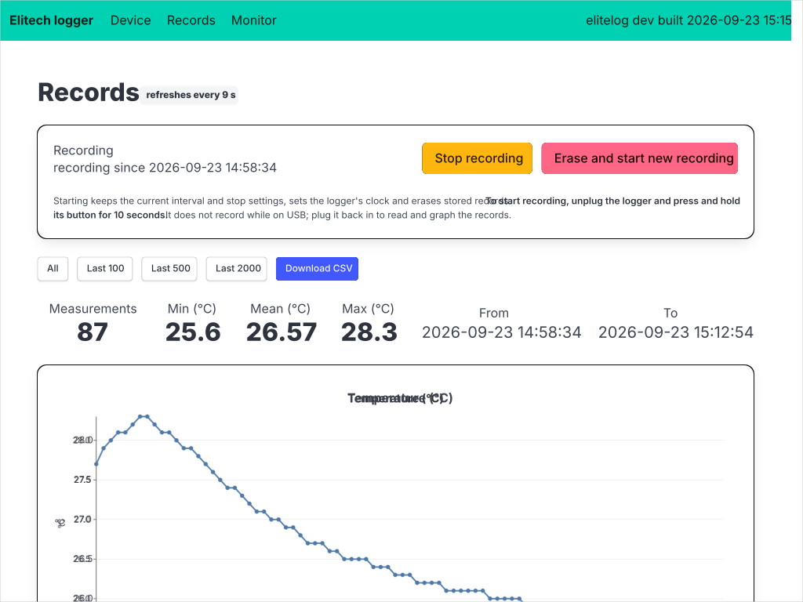
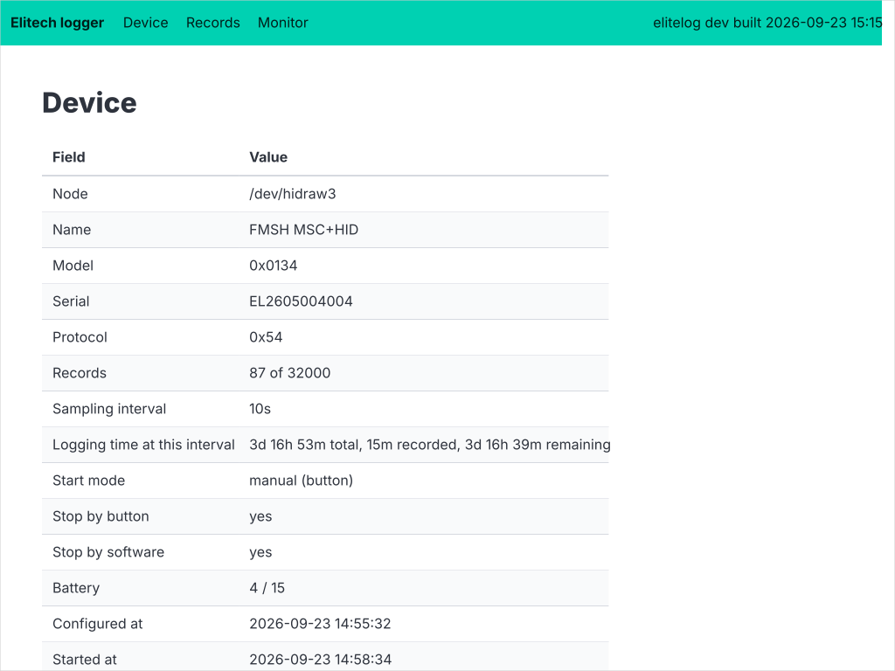

# go-elite-log

Local web app for Elitech USB temperature data loggers (the FMSH "MSC+HID"
generation, USB id `246c:9001`, e.g. RC-5). Finds the attached logger over
its HID interface, graphs the recorded temperatures and exposes the
logger's controls (clock, sampling interval, start/stop settings).

Pure Go, no cgo: talks to `/dev/hidrawN` directly. Linux only.

## Install

```
go install git.bytestone.uk/hum3/go-elite-log/cmd/elitelog@latest
sudo cp 99-elitech.rules /etc/udev/rules.d/ && sudo udevadm control --reload
```

Replug the logger after installing the udev rule.

## Use

```
elitelog serve        # web UI on http://localhost:1350 (device, records, monitor pages)
elitelog info         # print device state
elitelog records      # dump records as CSV (-last N for the newest N)
elitelog start        # erase the store and arm a new recording
elitelog stop         # send the stop command
elitelog peek         # raw parameter/status reads for protocol work
```

Or through the Taskfile: `task run`, `task info`, `task records LAST=100`.

## Screenshots

Monitor page, reloading every 5 s:



Records page with the temperature and humidity charts:



Device page with state and settings:



Regenerate with `task docs:screenshots` while a logger is attached.

## Starting a recording

Save settings (or "Erase and start new recording"), then unplug the logger
and **press and hold its button for 10 seconds**. The logger does not
record while connected over USB; plug it back in to read and graph the
records.

## Links

<!-- auto:links -->
| | |
|---|---|
| Source | https://git.bytestone.uk/hum3/go-elite-log |
| Mirror (GitHub) | https://github.com/drummonds/go-elite-log |
<!-- /auto:links -->

## Acknowledgements

The wire protocol was reverse engineered by
[elitech-hid-webui](https://github.com/andrasschad/elitech-hid-webui) and
[python-elitech](https://github.com/pasccom/python-elitech); this is an
independent Go implementation of what they documented.
